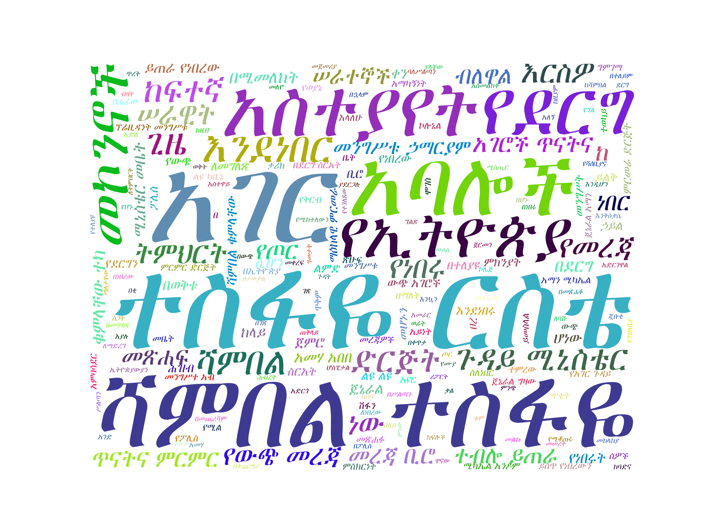

# Amharic text summarizer

Generate [Amharic](https://en.wikipedia.org/wiki/Amharic) text summarizer using python

Algorithm 1: Extraction
1. Extract all the sentences from text.
2. Extract all the words from text.
3. Assign a score to each word.
4. Assign a score to each sentence.
5. Put the sentences with the highest score together in chronological order to produce the summary.

Algorithm 2: Cosine Similarity
1. TF-IDF weights to each individual word in a sentence
2. Generate cosine-similarity of each TF-IDF sentence pair matrix
3. Average the weights of each vector
4. Vectors with highest average summarize the text
words with higher weights (more unique) have more importance

Algorithm 3: word cloud based on: https://github.com/millzon/wordcloud-am

Algorithm 4: Abstract
- TODO

Intallation 

>pip install -r requirements.txt

>python main.py

Example
pdf at: https://amnewsupdate.files.wordpress.com/2010/09/asteway.pdf
* Extraction summary:

> "ተዘግቶ የነበረው መጋረጃ ሲገለጥ የሚል ርእስ የሰጠሁበት ዋናው ምክንያት እነ ሻምበል አምሃ አበበና የመሳሰሉት በመቶዎች የሚቆጠሩ ብዙ ወጣት መኮንኖች የበታች ሹሞችና ወታደሮች በኮርስ ወይም በቅርብ ጓደኞቻቸው የሀሰት ጥቆማ ተካሂዶባቸው ህይወታቸው የተቀጨበት አካለ ስንኩላን የሆኑበት ምክንያት ብዙ ሚስጢር መውጣት በመጀመሩ ነው። ኮሎኔል መርሻ ወዳጆ በመጽሐፉ ሽፋን ላይ ስለመጽሐፉ የሚከተለውን አስተያየት ሰጥተዋል። ጄኔራል አማን የጦር አለቆችን ማነጋገር መጀመራቸው የደርግ አባላቱ ሲረዱ የፍርሃትና የጭንቀት ብርድ ውስጥ ከተታቸው። ደህንነቱ ልዩ ልዩ የጦር ክፍሎችና ከፖሊስ ሠራዊት ተዛውረን የመጣን ሲሆን ከመሥሪያ ቤቴ የሰው ኃይል ሲነፃፀር ብዛት ባይኖራቸውም በተለያዩ የትምህርት ዘርፎች በዶክትሬት በማስትሬት በባችለር ዲግሪ ከዚያም ዝቅ ሲል በዲፕሎማ የተመረቁ በተጨማሪ ብዛት ያላቸው ሠራተኞች ወደ ተለያዩ ሶሻሊስት አገሮች ተልከው የመረጃና የሶሻሊስት ርእዮተ ዓለም ትምህርት የተክታተሉ አባሎች እንደነበሩ እሙን ነው። በሰሜን በኩል የነበረው የኢትዮጵያ ጦር መፈረካከስና መበተን የጀመረው ከግንቦት ቀን በኋላ እንደሆነ ግልጽ ነው። አስተያየት በእርግጥም የውጭ መረጃ ሠራተኞች ጂቡቲ ሆነው የሱማሌን መንግሥት የጦር ቢሮ ቦርቡረው ውጤት አስገኝተዋል የሚለው እውነትነት ካለው ሁላችንንም ማለትም በደህነነት መቤት ውስጥ የነበርነውን ሠራተኞች ሁሉ የሚያኮራን ነው። ከ ዓም ወዲህ የሻዕቢያና የ ወያኔ ቡድን አባሎች በጋራና በተናጠል አገር ውስጥ በስውር ይንቀሳቀሱ እንደነበር በተመሳሳይ ጂቡቲ ኬኒያ ሱማሌና በተለይም ሱዳን ውስጥ ጽሕፈት ቤቶቻቸውን ከፍተው በከፍተኛ ደረጃ ፀረ ኢትዮጵያ እንቅስቃሴ ሲያደርጉ እንደነበር ይታወቃል። ሻምበል ተስፋዬ ርስቴ በጻፉት መጽሐፍ በገጽ የውጭ አገሮች ጥናትና ምርምር ድርጅት ውስጥ እየተገናኙ ውይይት ያደርጉ እንደነበር ገልጸዋል። ስለዚህ የፕሬዚዳንት መንግሥቱ ኃማርያም ማንነትና የሚስጥር አማካሪዎቻቸው እነማን እንደነበሩ ከላይ የተገለጸው ጥሩ ማስረጃ ነው እላለሁ። በእርግጥ ከላይ ስማችሁ የተገለጸው መኮንኖች የአንድ ኮርስ መኮንኖች መሆናችሁን በወቅቱ ሻምበል ቁምላቸው ተካና ሻምበል አመሀ አበበ አንድ ቤት ውስጥ ተከራይተው ይኖሩ እንደነበር ይነገራል።"

* Cosine similarity summary:

> "የቀድሞ የደርግ መንግስት አገልጋይ የነበርኩ ሻምበል አስተዋይ ለጓድ ሻምበል ተስፋዬ ርስቴ ከ ዓም ወዲህ በደርግ ስርአት ስለነበረው የአገር መከላከያ ሚኒስቴር መቤት አንዳንድ መኮንኖች በወቅቱ ስለነበረው የመለዮ ለባሹ ሚናና ምን አይነት አመራር ይሰጥ እንደነበር ገመናቸውን ጭምር በመጽሐፍ መልክ ጽፈው ህብረተስቡ እንዲያነበው ማድረጋቸው ይታወሳል።  ከ ዓም በፊት አገር ግዛት ሚኒስቴር ተብሎ ይጠራ የነበረው በደርግ ስርአት አገር ውስጥ ጉዳይ ሚኒስቴር ልዩ ካቢኔ ተብሎ ይጠራ የነበረው ድርጅት ውጭ አገሮች ጥናትና ምርምር ድርጅት የፖሊስ ሠራዊት ተብሎ ይጠራ የነበረው የአብዮታዊ ፖሊስ ሠራዊት የሕዝብ ፀጥታና ጥበቃ ተብሎ ይጠራ የነበረው የውስጥ ደህነነት በፖሊስ ሠራዊት ጠቅላይ አዛዥ ስር ይመራ የነበረውና የልዩ ቅርንጫፍ ተብሎ ይጠራ የነበረው መምሪያ ለተወሰኑ ጊዜያት የውንብድና መቆጣጠሪያና መከላከያ በመጨረሻም ማዕከላዊ ምርመራ ድርጅት ተብሎ እንዲጠራና ተጠሪነቱም በቀጥታ ለአገር ውስጥ ጉዳይ ሚኒስቴር እንዲሆን ተወስኗል።  የጄኔራል አማን ሚካኤል አንዶም አሟሟትን በሚመለከት ሻምበል ተስፋዬ ርስቴ ጄኔራል ሚካኤል አንዶምን በሚመለከት እንዲህ ብለዋል።  ይህ በሁለቱ ጄኔራሎች መሀል የተደረገ የስልክ ልውውጥ ጄኔራል ግዛው በላይነህ በደርግ እስከመጨረሻው የተከበሩ እንዲሆኑ የጄኔራል አማን ሚካኤል አንዶም መጨረሻ ቅጽበታዊ እንዲሆን የፖለቲካ ሁኔታው አስገደደ ገጽ ይህን መልእከት የጠለፈው ልዩ ካቢኔ በወታደራዊ አስተዳደር ወቅት የውጭ አገሮች ጥናትና ምርምር ድርጅት የሚባለው የውጭ መረጃ ቢሮ ነው ገጽ ይላል አስተያየት ውድ ሻምበል ተስፋዬ ርስቴ ጄኔራል አማን ሚካኤል አንዶም በ መጀመሪያ ወራት የአገሪቱ ርዕሰ ብሔር በሆኑ በጥቂት ወራት ውስጥ የደርግ አባላቱ አገርን ለመምራት ብቃት እንደሌላቸው አገሪቱም በነሱ ተመርታ ወደጥፋት መሄድ የለባትም ማለታቸው አገራችን አሁን ከደረሰችበት እውነታ ጋር ሲመዛዘን ትክክለኛ ትንበያ የተናገሩ አይመስልምን።  ጄኔራል አማን ሚካኤል አንዶም የደርግን ስርአት ለመቀየር የነበረው እቅዳቸው ሊከሽፍ የቻለው በአገር ውስጥ ጉዳይ ሚኒስትር የውጭ አገሮች ጥናትና ምርምር ተብሎ ይጠራ የነበረው ድርጅት ስልክ በመጥለፍ ባስተላለፈው ሪፖርት መሠረት መሆኑን ሻምበል ተስፋዬ ርስቴ ልብ ሊሉት ይገባል እላለሁ።  ቀድሞ ስሙ ልዩ ካቢኔ በደርግ ሥርዓት ውጭ አገሮች ጥናትና ምርምር ተብሎ ይጠራ የነበረውን ድርጅት በሚመለከት ይህን ድርጅት አስመልክቶ ፀሐፊው እንዲህ ብለዋል።  ሻምበል ተስፋዬ ርስቴ በጻፉት መጽሐፍ በገጽ የውጭ አገሮች ጥናትና ምርምር ድርጅት ተወካይ ከአሜሪካን ከእስራኤልና ከምዕራብ ጀርመን የመረጃ ተወካዮች ጋር ውጭ አገሮች ጥናትና ምርምር ድርጅት ውስጥ እየተገናኙ ውይይት ያደርጉ እንደነበር ገልጸዋል።  ሻምበል አመሃ አበበን በሚመለከት ሻምበል ተስፋዬ ርስቴ ሻምበል አመሃ አበበን በሚመለከት እንዲህ ብለዋል።  አስተያየት ሻምበል ተስፋዬ ርስቴ ስለነሻምበል አመሃ አበበ ሊገልጹ የፈለጉት ሻምበል አመሃ አበበ የኢሕአፓ አባላ እንደነበር አራት ሆነው ስለሻለቃ መንግሥቱ ኃማርያም ስልጣን መቀረፍ የተወያዩትን ሻምበል ቁምላቸው ተካ ለደርግ ባለሥልጣኖች ሪፖርት ያደረጉ ለመሆኑ ለመግለጽ የሞከሩ ይመስላል።  ከላይ ስማቸው የተገለጸው መኮንኖች ስለሻለቃ መንግሥቱ ኃማርያም ሥልጣን መቀረፍ ከተወያዩ ከ ቀን በኋላ መቶ አለቃ አለማየሁ ኃይሌ ከተገደሉ ሻምበል መንግሥተ አብ ባህሩ ከታሠሩ ሻምበል ቁምላቸው ተካ ከ ቀን በኋላ በሻለቃ መንግሥቱ ኃማርያም ትእዛዝ ዩጎዝላቪያ ለትምህርት ከተላኩ የሻምበል ተስፋዬ ርስቴ እጣ ፋንታ ምን እንደሆነ ሊታወቅ ወይም ሊገለጽ የሚገባው ነበር።  እርስዎ ሻምበል ተስፋዬ ርስቴ በወቅቱ እንዳልታሠሩ ይታወቃል።"

* Abstract summary:

> <mark>Todo</mark>

* word cloud:

Reference links:  
- https://towardsdatascience.com/understand-text-summarization-and-create-your-own-summarizer-in-python-b26a9f09fc70
- https://github.com/icoxfog417/awesome-text-summarization#motivation
- https://blog.floydhub.com/gentle-introduction-to-text-summarization-in-machine-learning/
- https://github.com/AustinKrause/nyt-article-summarizer
- https://www.machinelearningplus.com/nlp/cosine-similarity/

